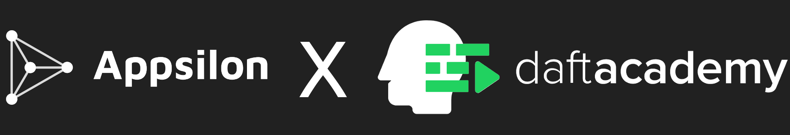

# Python LevelUP: Data Science by Appsilon



Strona materiały do kursu Python LevelUP: Data Science by Appsilon.
Nowe fragmenty będą pojawiać się na bieżąco.

## Harmonogram

- 12.05 | Czym jest Data Science i jak wygląda krajobraz używanych narzędzi? Zapoznanie z numpy’em.
- 19.05 | Rola ramek danych w analizie danych. Czym są dane tabelaryczne i jak na nich pracować? Zapoznanie z pandasem.
- 26.05 | Wstęp do wizualizacji danych - matplotlib/plotly.
- 02.06 | Machine learning dla początkujących - scikit-learn.
- 09.06 | Tworzenie dashboardów w streamlit.
‍
## Środowisko pracy

Do pracy będziemy wykorzystywać:

- Python 3.9/3.10 via [Anaconda](https://www.anaconda.com/products/distribution#Downloads) + liczne paczki
- Visual Studio Code aka [VS Code](https://code.visualstudio.com/download)

### Anaconda i Środowisko pythonowe

Zainstaluj [Anacondę](https://www.anaconda.com/products/distribution#Downloads) korzystając z oficjalnej strony.

Ściągnij repozytorium gitowe.
Następnie w terminalu (jeżeli korzystasz z Linuxa/Maca) lub uruchamiając _Anaconda prompt_ przejdź do folderu z repozytorium, a następnie wywołaj następujące polecenia:

```
conda create -n daftacademy-ds python
conda activate daftacademy-ds
pip install -r requirements.txt
```

Środowisko powinno być gotowe!
W razie problemów popatrz na [tutorial condowy](https://docs.conda.io/projects/conda/en/latest/user-guide/getting-started.html#starting-conda).

### VS Code

Podczas kursu będziemy korzystać z [VS Code](https://code.visualstudio.com/)'a jako naszego IDE.
Będziemy w nim puszczać zarówno skrypty jak i notebooki jupyterowe.

Po zainstalowaniu VS Code'a uruchom go i zainstaluj wtyczki:

- [Pylance](https://marketplace.visualstudio.com/items?itemName=ms-python.vscode-pylance)
- [Jupyter](https://marketplace.visualstudio.com/items?itemName=ms-toolsai.jupyter)

## Przydatne linki i tutoriale

- [Podstawy condy](https://docs.conda.io/projects/conda/en/latest/user-guide/getting-started.html#starting-conda)
- [Jupyter notebook shortcuts tutorial](https://towardsdatascience.com/jypyter-notebook-shortcuts-bf0101a98330?gi=83c2d75b21ec)
- [Python in VS Code](https://code.visualstudio.com/docs/python/python-tutorial)
- [Jupyter notebooks in VS Code](https://code.visualstudio.com/docs/datascience/jupyter-notebooks)

## Licencja

Materiały zostały stworzone przez @pstorozenko z [Appsilon](https://appsilon.com/) i są dostępne na licencji [CC BY 4.0](https://creativecommons.org/licenses/by/4.0/).